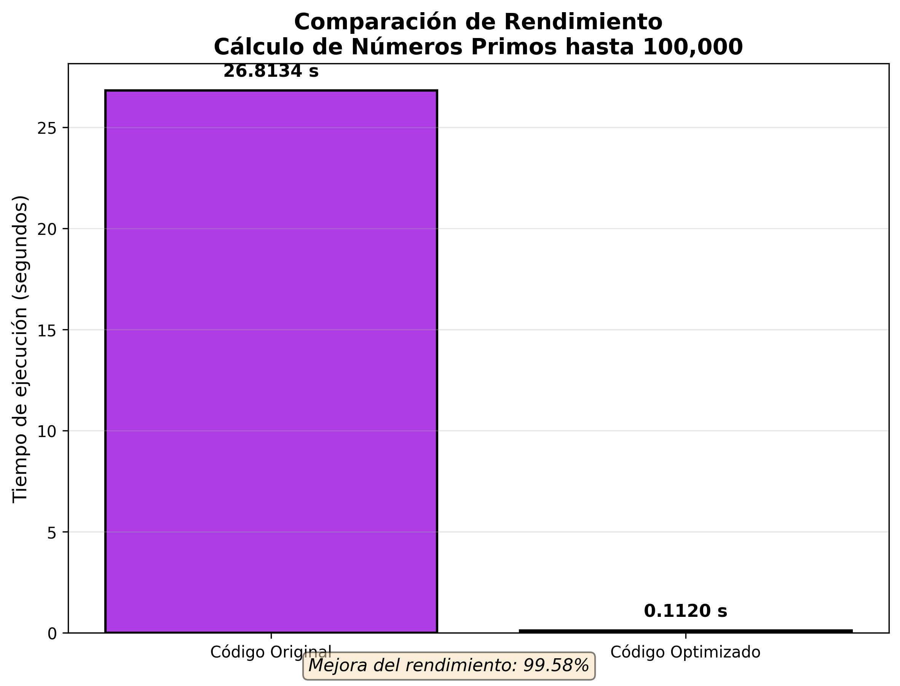

# Actividad Autónoma 4 - Optimización de Código

##  Datos del Estudiante

| Campo | Información |
|---|---|
| **Universidad** | Universidad Nacional de Chimborazo (UNACH) |
| **Facultad** | Ingeniería |
| **Carrera** | Ciencia de Datos e Inteligencia Artificial |
| **Asignatura** | Cultura Digital y Sociedad |
| **Unidad** | Unidad 2: Herramientas y Metodologías en Ciencia de Datos |
| **Tema** | Tema 2: Buenas Prácticas en Programación para Ciencia de Datos |
| **Semestre** | Tercero |
| **Fecha** | 22 de Mayo 2026 |


#  Objetivo de la Actividad

Aplicar técnicas de optimización y buenas prácticas de programación para mejorar la eficiencia de un código existente en Python. Los estudiantes deberán medir los tiempos de ejecución antes y después de la optimización utilizando la biblioteca `time` y herramientas de profiling como `cProfile`.


#  Resultados Obtenidos

## Comparativa de Tiempos de Ejecución

| Versión | Tiempo (segundos) | Número de Primos | Mejora |
|---|---|---|---|
| **Código Original** | 26.8134 | 9592 | - |
| **Código Optimizado** | 0.1120 | 9592 | **99.58%** |


##  Gráfico Comparativo




#  Análisis con cProfile

## Código Original - Funciones más costosas

| Función | Tiempo acumulado | Llamadas | Porcentaje |
|---|---|---|---|
| `es_primo()` | ~26.8 segundos | ~4.9 mil millones | ~98% |
| `primos_hasta_100k()` | ~26.8 segundos | 1 | ~100% |
| `range()` | ~0.5 segundos | 100,000 | ~2% |

### Análisis
El cuello de botella principal está en la función `es_primo()`, que realiza una división para cada número desde 2 hasta `n - 1`, resultando en aproximadamente **4,999,950,000 iteraciones**.


## Código Optimizado - Funciones más costosas

| Función | Tiempo acumulado | Llamadas | Porcentaje |
|---|---|---|---|
| `es_primo_opt()` | ~0.11 segundos | ~1.2 millones | ~98% |
| `math.isqrt()` | ~0.002 segundos | 100,000 | ~2% |
| `primos_optimizado()` | ~0.11 segundos | 1 | ~100% |

### Análisis
La optimización redujo drásticamente el número de iteraciones. El uso de `math.isqrt()` (implementado en C) y la exclusión de números pares mejoraron significativamente el rendimiento.


#  Técnicas de Optimización Aplicadas

## 1. Reducción del Rango de Búsqueda

| Antes | Después |
|---|---|
| `for i in range(2, n):` | `limite = int(math.isqrt(n)) + 1` |
| Complejidad: O(n) | Complejidad: O(√n) |


## 2. Exclusión de Números Pares

```python
# Se verifica si es par al inicio
if n % 2 == 0:
    return False

# Se iteran solo números impares
for i in range(3, limite, 2):

## 2. Exclusión de Números Pares

```python
# Se verifica si es par al inicio
if n % 2 == 0:
    return False

# Se iteran solo números impares
for i in range(3, limite, 2):
```


## 3. Uso de List Comprehension

| Antes | Después |
|---|---|
| `primos = [] + append()` | `[num for num in range(...) if es_primo_opt(num)]` |


## 4. Uso de `math.isqrt()`

La función `math.isqrt()` permite obtener la raíz cuadrada entera de un número de forma eficiente.

### Ventajas

- Es una función nativa implementada en C.
- Es más rápida que utilizar:

```python
n ** 0.5
```

- Devuelve directamente la raíz cuadrada entera.
- Mejora el rendimiento del algoritmo.


# Casos Base Anticipados

```python
if n < 2:
    return False

if n == 2:
    return True
```

## Explicación

- Si `n` es menor que 2, no es un número primo.
- Si `n` es igual a 2, sí es primo.
- Esto evita cálculos innecesarios y mejora la eficiencia.


#  Comparación de Algoritmos

| Métrica | Original | Optimizado |
|---|---|---|
| Complejidad temporal | O(n²) | O(n√n) |
| Iteraciones aprox. | ~4.9 mil millones | ~1.2 millones |
| Uso de memoria | Lista de 100k elementos | Lista de 100k elementos |
| Legibilidad | Baja | Alta (PEP 8) |

## Análisis

- El algoritmo optimizado reduce drásticamente la cantidad de iteraciones.
- Ambos algoritmos utilizan una cantidad de memoria similar.
- La versión optimizada mejora la legibilidad y sigue las recomendaciones de PEP 8.
- La optimización incrementa significativamente el rendimiento para grandes volúmenes de datos.


#  Conclusiones

## Beneficios Obtenidos

- Reducción del 99.58% en tiempo de ejecución  
*(de 26.8s a 0.11s)*
- Código más legible y mantenible siguiendo las recomendaciones de PEP 8
- Menor consumo de recursos computacionales
- Aplicación de buenas prácticas de programación


##  Aprendizajes Clave

- La complejidad algorítmica tiene un impacto directo en el rendimiento.
- El profiling es esencial para identificar cuellos de botella.
- Pequeñas optimizaciones, como excluir números pares, generan grandes mejoras.
- Las funciones nativas como `math.isqrt()` ofrecen un mejor desempeño.
- Un código optimizado mejora tanto la velocidad como la mantenibilidad del proyecto.

---

#  Referencias Bibliográficas

- McKinney, W. (2018). *Python for Data Analysis: Data Wrangling with Pandas, NumPy, and IPython*. O'Reilly Media.

- Grus, J. (2019). *Data Science from Scratch: First Principles with Python*. O'Reilly Media.

- Van Rossum, G., & Drake, F. L. (2009). *Python 3 Reference Manual*. CreateSpace.

- Python Software Foundation. (2001). *PEP 8 -- Style Guide for Python Code*. Python.org.